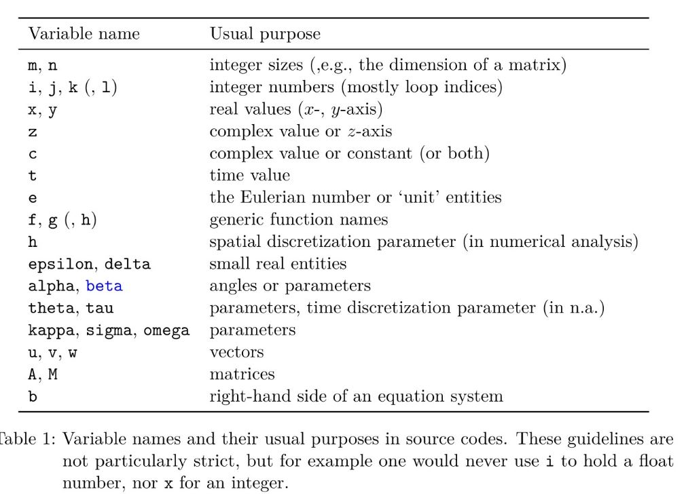
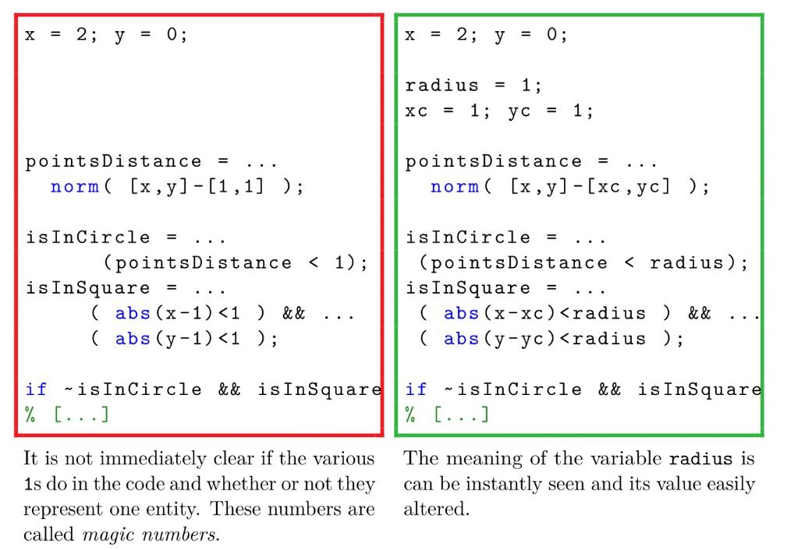

# Summary for Best Practices in Using MATLAB 
(ref: Guidelines for writing clean and fast code in MATLAB)
## Clean Code 

### Helper Function 
Helper functions are functions within a function file. Helper function will not be visible to other function files in the directories. 

### Subfunction 
Subfunctions are functions within a function. It provides hierarchy to the functions for visibilities. 

### Variable names and function names 

- use UPPER-CASE for matrices 
- use lower-case for vector and scalar 

### Magic Number 
Magic number is numerical constants that are "hard-coded". Instead of directly placing hard-coded constants into other functions, place it in separate places. 

### Error and warnings 
Cannot assume users always provide correct input data. 
- disp()
- warning()
- error()
One can provide message ID with a clue where the error has occurred and what type of error  

## Faster code 

### Using the profiler 
measure the execution time for each line of code and depicts the results graphically 

### Pre-allocation 
MATLAB needs to look for memory which takes a lot of time 

### Loop vectorization 
because of preallocation, it is best to avoid loops. most MATLAB functions can take in vector as an input 

### Dense and sparse matrices 
sparse matrices are ones with small number of non-zero elements. Users can create sparse matrices to reduce the size and increase the efficiency. Functions:
- sparse()
- sodiags()
- speye()
- kron()

## Memory Optimization 
(ref: https://www.mathworks.com/company/newsletters/articles/programming-patterns-maximizing-code-performance-by-optimizing-memory-access.html)
### Preallocate arrays 

### Store and access data in columns 

### Avoid creating unncessary variables 
use in-place operations (i.e. modifying existing variables )

## How to use MATLAB Profiler 
(ref: https://blogs.mathworks.com/community/2010/02/01/speeding-up-your-program-through-profiling/)
1. Find a program you wish to speed up.
2. Run that code with appropriate inputs in the Profiler.
3. Fix any performance-related M-Lint warnings in your file (if you haven’t already). The Profiler can help you asses which warnings are most significant.
4. Look for the lines where the code spent the most time, and try to call that line fewer times, replace it with faster statements, or break your code into smaller problems.
5. Repeat until there’s nothing left to improve.